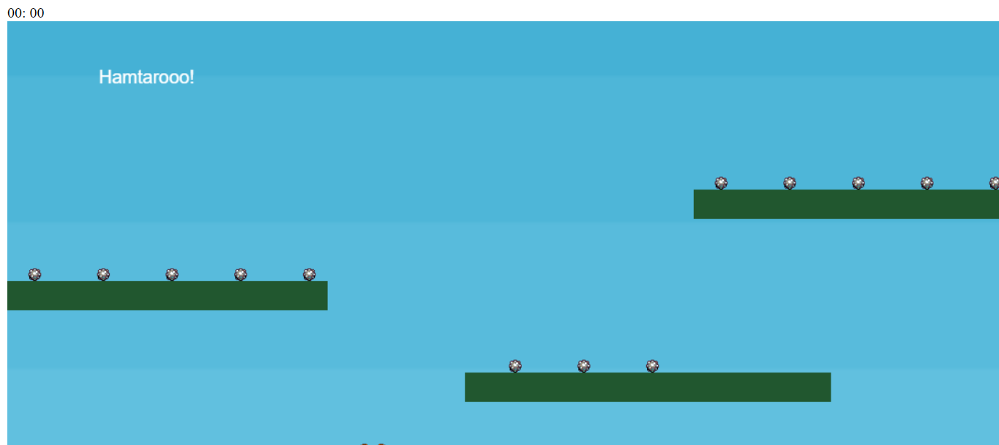

# HAMTARO
👨‍🏫O OBJETIVO DO JOGO É CONTROLAR HAMTARO USANDO O TECLADO PARA MOVÊ-LO PARA A ESQUERDA, DIREITA E FAZÊ-LO PULAR, COLETANDO ESTRELAS ESPALHADAS PELO CENÁRIO.

 <br> 

## DESCRIÇÃO:
Este jogo é um simples plataforma onde o jogador controla um personagem chamado Hamtaro que deve coletar estrelas em um cenário com várias plataformas. O objetivo do jogo é controlar Hamtaro usando o teclado para movê-lo para a esquerda, direita e fazê-lo pular, coletando estrelas espalhadas pelo cenário.

## EXECUTANDO O PROJETO:
1. **Instalando as Depêndencias:**
   - Para instalar as dependências listadas no arquivo "package.json", você pode usar o comando `npm install` no terminal. Certifique-se de estar no diretório do seu projeto onde o arquivo "package.json" está localizado. O npm irá ler o arquivo "package.json" e instalar todas as dependências listadas nele:

   ```bash
   npm install
   ```

2. **Subindo o Servidor:**
   - Para subir o servidor, no diretório do seu [projeto](./CODIGO/), digite o seguinte comando no Terminal/CMD:
   ```bash
   npm dev
   ```

   - Abra o navegador e navegue até [http://localhost:8000](http://localhost:8000) para ver seu jogo em ação.

3. **Jogando:**
   1. **Movimentação:**
      - **Esquerda:** Pressione a seta esquerda do teclado.
      - **Direita:** Pressione a seta direita do teclado.
      - **Pular:** Pressione a seta para cima do teclado (funciona apenas se o personagem estiver tocando o chão).

   2. **Coletar Estrelas:**
      - Movimente Hamtaro para tocar nas estrelas. As estrelas serão coletadas automaticamente quando o personagem as tocar.

## NÃO SABE?
- Entendemos que para manipular arquivos em `HTML`, `CSS` e outras linguagens relacionadas, é necessário possuir conhecimento nessas áreas. Para auxiliar nesse aprendizado, oferecemos cursos gratuitos disponíveis:
* [CURSO DE HTML E CSS](https://github.com/VILHALVA/CURSO-DE-HTML-E-CSS)
* [CURSO DE JAVASCRIPT](https://github.com/VILHALVA/CURSO-DE-JAVASCRIPT)
* [CURSO DE PHASER](https://github.com/VILHALVA/CURSO-DE-PHASER)
* [CURSO DE NODEJS](https://github.com/VILHALVA/CURSO-DE-NODEJS)
* [CONFIRA MAIS CURSOS](https://github.com/VILHALVA?tab=repositories&q=+topic:CURSO)

## CREDITOS:
- [PROJETO CRIADO PELA "PatriciaFerreiraMatos"](https://github.com/PatriciaFerreiraMatos/JogoJS)
- [PROJETO EDITADO PELO VILHALVA](https://github.com/VILHALVA)


